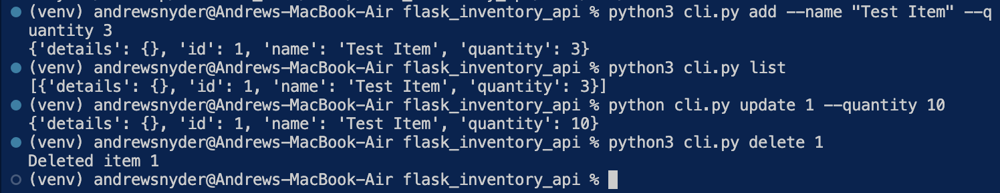

# Inventory Management System

A Flask‑based REST API for managing inventory items, with OpenFoodFacts integration and a CLI frontend.

## Features

- CRUD endpoints for inventory items (in‑memory storage)
- External API lookup via `/inventory/fetch` (barcode or name)
- CLI tool for command‑line interaction
- Automated tests with pytest and monkeypatch

## Prerequisites

- Python 3.8+
- Git (optional)

## Installation

1. **Clone the repo**  
   git clone <your‑repo‑url>  
   cd flask_inventory_api

2. **Create & activate a virtual environment**  
   python3 -m venv venv  
   source venv/bin/activate   # macOS/Linux  
   .\venv\Scripts\Activate.ps1   # Windows PowerShell

3. **Install dependencies**  
   pip install -r requirements.txt

## Running the API

1. **Set the Flask app factory**  
   export FLASK_APP="app:create_app"    # macOS/Linux  
   $Env:FLASK_APP = "app:create_app"    # PowerShell

2. **Start the server**  
   flask run

The API will be at http://127.0.0.1:5000.

## API Endpoints

- GET /inventory                  List all items
- GET /inventory/<id>             Retrieve one item by ID
- POST /inventory                 Create a new item
- PATCH /inventory/<id>           Update fields on an item
- DELETE /inventory/<id>          Remove an item
- GET /inventory/fetch?barcode=… Lookup by barcode
- GET /inventory/fetch?name=…    Lookup by name

### Example cURL

# Create an item

curl -X POST -H "Content-Type: application/json"  
    -d '{"name":"Widget","quantity":10}'  
    http://127.0.0.1:5000/inventory

# List items

curl http://127.0.0.1:5000/inventory

# Fetch by name

curl "http://127.0.0.1:5000/inventory/fetch?name=Almond%20Milk"

## CLI Usage

- List all items:  
      python cli.py list

- Add a new item:  
      python cli.py add --name "Almond Milk" --quantity 5

- View one item:  
      python cli.py view 1

- Update an item:  
      python cli.py update 1 --quantity 20

- Delete an item:  
      python cli.py delete 1

- Fetch product (barcode):  
      python cli.py fetch --barcode 012345678905

- Fetch product (name):  
      python cli.py fetch --name "Almond Milk"

## Sample Output

## Testing

Run all tests:  
pytest

## Project Structure

flask_inventory_api/  
├── app/  
│   ├── **init**.py   # Flask factory & state  
│   ├── routes.py   # Route registrations  
│   └── external_api.py   # OpenFoodFacts helpers  
├── cli.py   # Command‑line interface  
├── requirements.txt  
├── .gitignore  
├── README.md  
└── tests/  
    ├── conftest.py  
    ├── test_routes.py  
    └── test_cli.py
